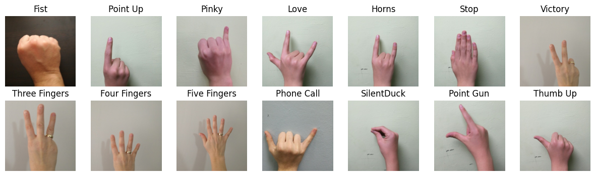
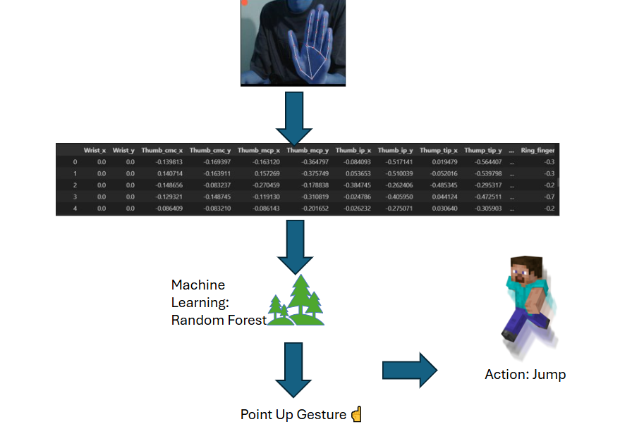

# Minecraft Gesture Control using MediaPipe

Control Minecraft using hand gestures via webcam! This project uses Python, MediaPipe, Machine Learning, and PyAutoGUI to translate hand gestures into in-game actions.

Make sure to checkout notebook_code.ipynb to show you how did I end up selecting Random Forest as the ML model


## 💎⛏️ Demo 1 Basic Movement


## 💎⛏️ Demo 2 Attack


# 🎮 Minecraft Gesture Control Guide

Control Minecraft using hand gestures detected by your webcam! Here is the complete list of controls:

## ✋ Gesture Controls

| Gesture | Icon | Action | Notes |
| :--- | :--- | :--- | :--- |
| **Victory** | ✌️ | **Open Inventory** | Presses `E` key |
| **Pinky** | 🌷 | **Move Forward** | Holds `W` key |
| **Horns** | 🤘 | **Move Backward** | Holds `S` key |
| **Fist** | ✊ | **Attack/Mine** | Holds left mouse button |
| **Three Fingers** | 👌 | **Mouse Look** | Move hand to control camera |
| **Point Up** | 👆 | **Jump & Move** | Holds `Space` + `W` |
| **Thumb Up** | 👍 | **Use Item/Place** | Right click |
| **Silent Duck** | 🦆 | **Special Actions** | See combinations below |

## 🔄 Special Combinations

### **Quick Click (Select Item)**
1. First make **👌 Three Fingers** gesture (mouse control)
2. Then switch to **🦆 Silent Duck** gesture
3. **Result:** Left click (perfect for inventory management)

### **Scroll Wheel**
1. First make **👍 Thumb Up** gesture 
2. Then switch to **🦆 Silent Duck** gesture
3. **Result:** Scroll up (useful for hotbar selection)

## 🎯 How to Play

1. **Ensure good lighting** on your hands
2. **Keep gestures clear and distinct**
3. **Return to neutral position** to release keys/buttons
4. **Use combinations** for advanced actions like inventory management

## 💡 Pro Tips
- The system automatically releases keys when you change from movement gestures
- Mouse sensitivity can be adjusted in the `mouse_buffer` variable
- Practice gestures away from the game first to build muscle memory

**Happy gaming! 🎮**


## 🎮 Project Overview

This project is divided into two main parts:

### Part 1: Basic Movement & Camera Control
- **Forward Movement**: Move your character forward
- **Backward Movement**: Move your character backward  
- **Free Look**: Control camera view with hand movements
- **Basic navigation gestures**

### Part 2: Combat & Inventory Management
- **Attacking**: Punch and fight mobs with gesture controls
- **Inventory Access**: Open/close inventory with gestures
- **Hotbar Switching**: Switch between hotbar slots seamlessly
- **Item selection and management**

## 🛠️ Technologies Used

- **Python 3.7+**
- **MediaPipe** - Hand gesture recognition
- **OpenCV** - Webcam feed processing
- **PyAutoGUI** - Simulating keyboard/mouse inputs
- **RandomForest** - Was used to classify gestures
- **Minecraft Java Edition**

## 🖼️ Dataset Used

Note: Only subset of this dataset was used, Original Dataset Link: https://link.springer.com/article/10.1007/s13369-021-05867-2



## 🤖 Machine Learning Workflow/Pipeline




## 📋 Prerequisites

Before running this project, make sure you have:

- Minecraft Java Edition installed and running [Note it does not work for Pocket Edition currently]
- A webcam connected to your computer
- install requirements, set up virtual environment for VSCODE to ensure installed packages do not conflict with existing ones
- Make sure to turn off Raw Input in mouse settings in Minecraft Java Edition
- Reduce Sensivtity of mouse to at least 40% or below

## 🔧 Installation

1. **Clone the repository**
   ```bash
   git clone https://github.com/yahiaabdelhady2023/Mediapipe-Minecraft-Gesture-Control.git
   

**📘 Project Reflection & Key Learnings**


This project was a significant learning experience in building a real-time, gesture-controlled application. Below are the key insights and technical lessons gained:

**Data Management & Processing**

HDF5 over CSV: Learned to use HDF5 for managing large datasets after experiencing system crashes with CSV. HDF5's superior compression drastically reduced memory usage and data saving/loading times.

Data Normalization: Understood the importance of normalizing MediaPipe landmark data relative to a central point (e.g., the wrist). This ensures model consistency regardless of the hand's distance from the camera, significantly improving machine learning performance.

**Computer Vision & Real-Time Systems**

Image Format Handling: Gained practical knowledge of the difference between OpenCV's BGR color format and MediaPipe's required RGB format, implementing necessary conversions in the pipeline.

Real-Time Buffering: Implemented smoothing techniques for both mouse coordinates and gesture predictions by using averaging buffers. This effectively reduced jittery movement and created a more seamless user experience.

Performance Optimizations: Researched the benefits of raw mouse input for low-latency applications and learned about advanced filtering techniques like the Kalman filter for further stabilizing real-time data.

**Machine Learning & Model Management**

Model Persistence with Joblib: Discovered the simplicity and efficiency of using Joblib for saving and loading trained Scikit-learn machine learning models.

Algorithm Selection: Explored the potential of sequence models like LSTM and GRU for video data but confirmed that a Random Forest classifier was sufficiently accurate and performant for the scope of this project (simple gesture control, not complex sign language).

Data Augmentation: Discovered the critical importance of data augmentation through horizontal flipping. Initially, models performed poorly on gestures like "silent duck" because they were biased toward specific hands. Augmentation made the models hand-agnostic and significantly improved generalization.

**Software Architecture & Concurrency**

Threading for Responsiveness: Successfully used threading to run the Minecraft control script in parallel, preventing the PyAutoGUI commands from blocking the main CV processing thread and ensuring smooth, real-time operation.

This project solidified my understanding of end-to-end system design, from data collection and model training to building a responsive, multi-threaded application.